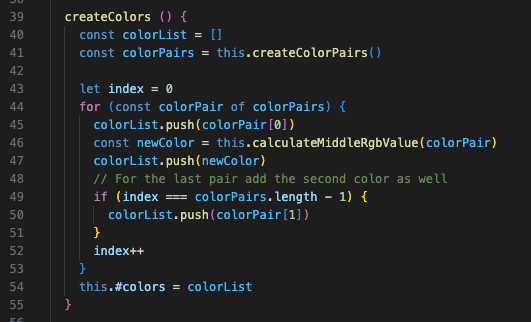
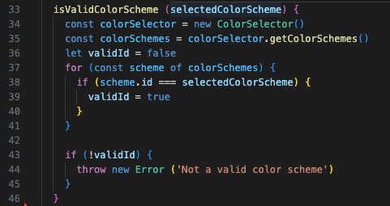
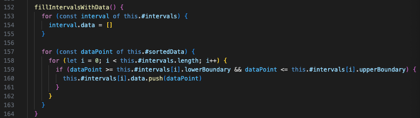
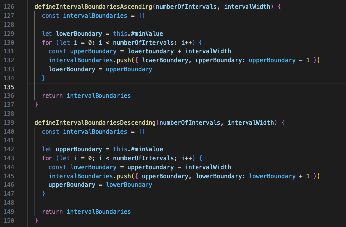
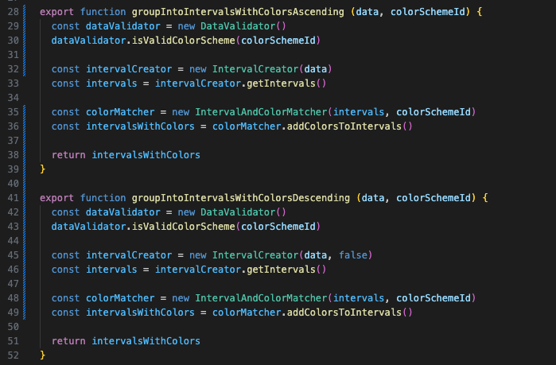
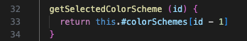

# Reflektioner över laboration 2

## Innehåll
- [Tabellreflektion över namngivning](#tabellreflektion-över-namngivning)
- [Reflektion över kapitel 2](#kapitelreflektion-kapitel-2)
- [Tabellreflektion för funktioner och metoder](#tabellreflektion-för-funktioner-och-metoder)
- [Reflektion över kapitel 3](#kapitelreflektion-kapitel-3)
- [Reflektion över kodkvalitet](#reflektion-över-egen-kodkvalitet)

## Tabellreflektion över namngivning
| Namn | Förklaring | Reflektion och regler från Clean Code |
|----- | ---------- | ------------------------------------- |
| DataProcessingService    | Klassnamn för klassen som skapar interval av datat | **Class names - avoid works like _Data, Processor, etc_**: Jag hade båda orden i namnet _DataProcessingService_ och ändrade därför namnet till IntervalCreator. Det gör det också tydligare vad klassen faktiskt gör: Den skapar interval av datat den får in. |
| ColorSelector            | Klassnamn för klassen som innehåller färgscheman   | **Class names**: Klassnamnet _ColorSelector_ är lite vilseledande eftersom den både håller alla färgscheman och returnerar det färgschemat man har valt. Enligt objekt-orienteringsprinciper hade det varit bättre med en klass _ColorScheme_ som definierar hur ett färgschema kan se ut och sedan en till klass eller variabel som håller de aktuella färgscheman. Eftersom alla färgscheman är förbestämda såg jag ingen vinst med att dela upp klassen i två. Hade användaren fått lägga till egna färgscheman hade det dock blivit tydligare och lättare att validera om de två delarna var separerade.  |
| groupIntoIntervalsAscending groupIntoIntervalsDescending groupIntoIntervalsWithColorsAscending groupIntoIntervalsWithColorsDescending | Metodnamn för metoderna som skapar interval av användarens data | **Avoid Disinformation - avoid names that vary in small ways**:  De första 18 tecken i de fyra metodnamnen var desamma vilket gjorde det svårt att se skillnad på dem och lätt att välja fel. Jag ändrade dem i stället till _getAscendingIntervals getDescendingIntervals getAscendingIntervalsWithColors getDescendingIntervalsWithcolors_. De är fortfarande väldigt snarlika, men något kortare och lättare att läsa och uttala (**Use pronouncable names**).  |
| ColorMatcher.getColors() | Metodnamn för metoden som lägger till färger till intervallerna | **Avoid Disinformation**: _get_ i början av metodnamnet får en att tro att metoden hämtar färger, när den i själva verket lägger till en färg till varje intervall. För att göra det tydligare döpte jag om den till _addColorsToIntervals()_ och delade också upp den ursprungliga klassen _ColorMatcher_ i en klass _ColorCreator_, som ansvarar för att skapa färgerna, och en klass _IntervalAndColorMatcher_, som lägger till färger till intervallerna. |   
| selectedColorScheme selectedColorSchemeId getSelectedColorScheme      | Parameternamn för färgschemat användaren har valt samt namn för metoden som hämtar schemat | **Make Meaningful Distinctions - avoid noise words and redundant information**: _selected_ är redundant information eftersom det känns självklart att användaren vill hämta det färgschema den har valt. Detsamma gäller metodnamnet _getSelectedColorScheme()_.  Jag tog därför bort _selected_: Parameternamnet _selectedColorScheme_ ändrade jag till _colorSchemeId_. Det bryter i sin ur mot regeln **Avoid Encodings**. Men eftersom vissa av mina metoder tar emot hela färgschemat som parameter ville jag visa tydligt när det ska vara ett ID. Metodnamnet ändrade jag till _getColorScheme()_ förutom i klassen som lägger till färger till intervallerna. Där tyckte jag att _getSelectedColorScheme()_ gör det tydligare att färgschemat som ska hämtas har valts av användaren. |

## Kapitelreflektion kapitel 2
Jag har alltid försökt att ha tydliga namn på variabler och funktioner, men har tidigare mest gått på magkänsla. Det var därför väldigt nyttigt att få tydliga principer för bra namngivning. När jag försökte följa dem blev det inte bara bättre namngivning utan också bättre kod eftersom det fick mig att strukturera om koden. I de fall det var svårt att komma på bra namn för metoder var det ofta så att de gjorde för mycket. Genom att bryta ut delar av metoder eller klasser blev koden tydligare och namngivningen lättare.   

När jag gick igenom namngivningen i min kod insåg jag bland annat att jag inte hade följt **Pick One Word per Concept**-principen. I klassen som skapar intervaller hade jag använt olika begrepp för samma koncept och skapat metoder som hette _defineNumberOfIntervals_, _defineIntervalWidth_ och _calculateRange_. Eftersom alla tre utför beräkningar ändrade jag från _define_ till _calculate_.

I det publika API:et hade jag metoder som hette _displayColorScheme_ och _displayColorSchemes_ Jag insåg först ganska sent att det leder till **Disinformation** eftersom det får en att tro att resultatet kommer att visas upp någonstans. Eftersom metoderna inte visar något utan bara returnerar ett eller flera scheman (som användaren sedan kan välja att visa i ett gränssnitt) så ändrade jag från _display_ till _get_.

Även om det var bra att använda boken som riktlinje var det svårt att alltid följa alla principer. Ibland tycker jag det blir tydligare att lägga till **Encodings** för att förtydliga vilken typ av värde en metod förväntar sig eller returnerar. Detta gäller särskilt i min klass _ColorConverter_ som konverterar mellan arrayer och strängar. Där döpte jag metoderna till _convertRgbStringToArray_ och _convertRgbArrayToString_ för att jag själv skulle komma ihåg vilken som var vilken. Men det behovet kan förstås också bero på vilket programmeringsspråk man använder. I starkt typade språk finns säkert mindre anledning att koda in datatyper i metod- och variabelnamn än i ett otypat språk som javascript.

## Tabellreflektion för funktioner och metoder
| Metodnamn | Länk eller kod | Antal rader (ej ws) | Reflektion |
| --------- | -------------- | ------------------- | ---------- |
| ColorCreator.**createColors()**  |  | 13 | **Functions should be Small and Do one thing**: Metoden är lång och innehåller en If-sats inuti en for-loop. For-loopen är längre än den skulle behöva vara eftersom jag valde en for/of-loop i kombination med ett extra index-värde som räknas upp, i stället för en klassisk for-loop. Men eftersom funktionen jobbar med två arrayer med väldigt snarlika namn tyckte jag att for/of-loopen blev tydligare. Den extra arrayen behövs eftersom jag inte bara vill lägga till de nya färgerna i slutet av den befintliga arrayen utan sortera om alla färger så att de blir sorterade efter färgskala. If-satsen har en inline-kommentar som skvallrar om att den delen skulle kunna brytas ut till en egen metod. Metoden gör flera saker i om att den både lägger till nya värden till en array och kollar ifall det är sista värdet i input-arrayen.  |
| DataValidator. **isValidColorScheme (selectedColorScheme)**  |  | 11 | **Do one thing**: For-loppen som används för att kontrollera om id:t motsvarar ett schema-id skulle kunna brytas ut till en egen metod. Den metoden skulle även vara användbar för att få bort den dåliga koden i sista exemplet nedan. |
| IntervalCreator. **fillIntervalWithData()** |  | 10 | **Blocks and indenting - level of indenting should be one or two**: Metoden har tre nivåer av indentering eftersom den har nästlade for-for-if-satser. Dessa skulle kunna brytas ut till egna metoder för att göra koden mer lättläst. |
| IntervalCreator. **defineIntervalBoundariesAscending (numberOfIntervals, intervalWidth)**   IntervalCreator. **defineIntervalBoundariesDescending (numberOfIntervals, intervalWidth)** | | 8 | **DRY**: Dessa två metoder är nästan identiska. De används för att lowerBoundary och upperBoundary blir omvända när det är en descending array. Vid en descending array behöver dessutom _intervalWidth_ subtraheras i stället för adderas. Jag testade att endast ha en metod som också kollar värdet på _isAscending_ och utifrån det avgör om det ska vara plus eller minus. Men det kändes som att den blev mer komplex än att ha två snarlika.  **Blocks and indenting - blocks within statements should be one line long**: Författaren nämner bara if-, else- och while-satser och i dessa två metoder är det en for-loop. Men den innehåller tre rader kod som skulle kunna brytas ut till en egen metod. Eventuellt skulle det vara ett steg mot att bara behöva ha en metod i stället för två snarlika. Jag har dessutom refaktorerat klassen och gjort _numberOfIntervals_ och _intervalWidth_ till instansvariabler. Men jag hade missat att uppdatera dessa två metoder efter det, utan skickade fortfarande in värdena som argument. I och med att detta inte längre är nödvändigt skulle det kanske vara lättare att göra om de två metoderna till en nu. |
| **groupIntoIntervalsWithColorsAscending (data, colorSchemeId)**  **groupIntoIntervalsWithColorsDescending (data, colorSchemeId)** | | 7 | **DRY**: Dessa två metoder är nästan identiska, men det var ett medvetet val. Jag hade bara en metod först, men då var användaren tvungen att skicka tre argument (_data, colorSchemeID, isAscending_) och det bröt mot principen att **undvika triadiska funktioner.**  Eftersom det vid två eller fler argument är lätt att kasta om argumenten var jag då tvungen att ha en extra validering som kollade att id:t verkligen var ett id och att isAscending var en boolean eller hade utelämnats. Jag var då också tvungen att lägga isAscending sist i parameterlistan eftersom det är ok att utelämna den. Detta blev inte intuitivt då det känns som att _data_ och _isAscending_ hör ihop (de används av samma klass).   Jag har numera döpt om metoderna men behållit de som två olika. De finns i det publika API:et och ur ett användarperspektiv är det enklare att välja mellan _ascending_ och _descending_ än att komma ihåg när man ska skicka med _true_ eller _false_ beroende på vilken sorteringsordning man vill ha.  |
| ColorSelector. **getSelectedColorScheme (id)**  |  | 1 | **Dålig kod**: Metoden innehåller bara en rad kod, men den är dålig. Man skulle kunna säga att den bygger på ett **Magic Number**. Den använder det inskickade id:t för att beräkna indexet av det objekt i arrayen som ska returneras. Metoden fungerar idag, men i fall man i framtiden uppdaterar id:na till en annan nummerserie eller tar bort ett av objekten i mitten, så kommer den returnera fel objekt. |

## Kapitelreflektion kapitel 3
Det kändes lite frustrerande när jag började läsa kapitel 3, för då insåg jag att jag skulle behöva göra om alla metoder som jag redan hade skapat. Då önskade jag att jag hade läst boken innan jag började koda på min modul. Men det kändes bättre sedan när jag kom till avsnittet _How Do You Write Functions Like This?_ (s. 49) där författaren påpekar att han också börjar med långa krångliga funktioner och sedan bearbetar dem och gör de mindre och mindre och tydligare och tydligare. Jag tycker att det var en bra poäng att kodning är som allt skrivande: att man börjar med att skriva ned sina tankar och sedan bearbetar texten (eller koden) tills man är nöjd. 

Allt eftersom jag läste kapitel 3 gjorde jag om många av mina metoder. Vissa av metoderna gjorde jag om flera gånger, fram och tillbaka.   
Jag hade t.ex. en konstruktor som tog tre argument. Eftersom jag läste att man skulle undvika tre argument refaktorerade jag från en konstruktor till set-metoder som tog ett argument var. Men jag hamnade fortfarande i att en av de publika funktionerna hade tre parametrar. Lösningen blev att jag dubblerade metoden så att användaren bara behöver skicka två argument. 
När jag hade löst det, och vi hade lärt oss om **Dependency Injection**, gick jag tillbaka till att använda konstruktorer med parametrar igen. 

Jag försökte följa principen att varje metod bara ska göra en sak och många av metoderna bröt jag ned till mindre metoder efterhand. Vissa metoder refaktorerade jag inte för att de var för långa, utan för att göra dem mer lättläst, t.ex. _isRangeWithinIntervals_. Där bytte jag plats på operanderna i if-satsens villkorsuttryck för att göra den mer lättläst och vände på true och false så att if-satsen testar det som metoden heter.
Jag har dock fortfarande flera metoder som är långa och spretiga och som skulle kunna brytas ned ytterligare. 

I det publika API:et (filen index.js) har jag försökt att ha så enkla fuktioner som möjligt och att hålla dem på en hög abstraktionsnivå.

Principen att inte ha fler än ett argument kändes som en bra riktlinje som hjälpte mig att göra min kod bättre. Min metod
_calculateMiddleRgbValue_ tog två argument som hette _firstRgbArray_ och _secondRgbArray_. Jag tyckte inte att namnen sa så mycket, men kom inte på några bättre, tills jag läste om _Argument Objects_ (s. 43). Eftersom anledningen till de två argumenten var att det behövs ett par av färger för att skapa en ny färg, insåg jag att färgpar passade bra som ett _argument object_. Då kom jag bort från att ha argument som hette _first_ och _second_. Koden blev inte bara bättre, utan den refaktoreringen hjälpte mig också att få till logiken med vilka färger som skulle blandas ihop till nya färger.   

Just algoritmen för hur färgerna ska blandas och sorteras var den som var svårast att få till. Målet var att ha ett färgschema med tre färger och utöka det med nya färger som bildar en gradvis övergång mellan de tre färgerna. Jag valde att helt enkelt ge varje ny färg ett RGB-värde som ligger precis mittemellan de två färger den blandas av. Det som var den största utmaningen var i vilken ordning färgerna skulle blandas och att sedan sortera dem så att det blev en gradvis övergång. Att följa bokens principer och refaktorera koden som hänger ihop med denna algoritm, samt att använda papper och penna hjälpte mig att få till detta till slut. Nu har jag en _createColors_-metod som jag känner mig nöjd med, även om den säkert går att göra ännu mer avskalad.

## Reflektion över egen kodkvalitet
Jag började med två stora, långa klasser (_DataProcessingService_ och __ColorSelector_) och jobbade sedan med att bryta isär dem i flera klasser utifrån vad dem gör. Det var väldigt nyttigt att läsa boken samtidigt som jag jobbade med modulen, eftersom jag fick många principer att utgå ifrån för att förbättra min kodkvalitet.

När jag granskade min kod utifrån de principerna blev det ganska tydligt att jag ofta skapar dyadiska och triadiska funktioner med ett stort antal nästlade konstruktioner. Jag tror också att jag ibland tar i lite för mycket och gör metod- och variabelnamnen för långa och krångliga. Gör jag funktionerna mindre kommer detta problem kanske lösa sig av sig själv, för då blir det säkert lättare att hitta tydligare namn. Även om det förstås inte går att komma ifrån att _Understandability_ kommer på bekostnad av _Readability_. 

För att komma ifrån funktioner med flera argument använde jag mig av _Dependency Injection_ och instansvariabler men också av _Argument Objects_.

Att bara ha anrop på samma abstraktionsnivå är något som jag tidigare aldrig hade reflekterat över. Jag har försökt följa det, men kommer behöva jobba mer med detta.   

För att minska beroenden, försökte jag så långt som möjligt undvika att klasserna importerar varandra och att bara göra det när det verkligen behövs.

Som jag nämnde i reflektionen över kapitel 2 så hjälpte funderingarna över namngivningen till att skapa bättre metoder och bättre kod. Namngivningen är förstås starkt kopplat till hur funktionerna är strukturerade, så det var bra att vi skulle läsa båda kapitel medan vi jobbade på modulen. 

Ibland var det svåra inte att bryta ned en metod till mindre metoder utan att veta var metoden skulle ligga för att få _High Cohesion_. Jag flyttade t.ex. valideringen av _colorSchemeId_ flera gånger. Från början hade jag den i de två publika metoderna som skapar interval med färger. Detta kändes bäst ur prestandasynpunkt eftersom programmet då inte behöver skapa upp alla interval innan man signalerar användaren att ID:t är felaktigt. Men valideringen behöver göras innan varje anrop till _getColorScheme_ och därför flyttade jag den dit. På så sätt blev det publika API:et renare, men prestandamässig var den första lösningen bättre.   
Att hitta en bra placering för try-catch-metoderna som fångar _Exceptions_ kändes också svårt, särskilt eftersom författaren påpekade att de ska ligga i sina egna funktioner och inte blandas med annan kod (s. 46-47). Jag valde till slut att lägga dem i det publika API:et eftersom det är där man vill fånga upp när användaren har angett felaktig input.

Jag har skrivit all kod själv, men jag visste inte hur man räknar om RGB-värden till hexadecimala värden. Där tog jag hjälp av information som jag hittade på [StackOverflow](https://stackoverflow.com/questions/5623838/rgb-to-hex-and-hex-to-rgb). Jag har inte noterat det i koden eftersom jag inte kopierade någon av lösningarna rakt av. 

För att säkerställa att modulen fungerar som den ska, har jag testat mycket. Men jag har fortfarande inte hittat någon optimal teststrategi. Jag vill gärna testa så fort jag har byggt en metod att den verkligen gör det jag har tänkt eller returnerar de värden jag förväntar mig. Men att skapa enhetstester när klasserna och metodnamnen fortfarande rör på sig väldigt mycket känns lite övermäktigt. Då skulle jag behöva skriva om enhetstesterna hela tiden. 
Att man inte kan testa privata metoder med enhetstester känns också som ett minus, men det löste jag genom att ha alla metoder publika ända in i det sista. 

Enhetstesterna har hjälpt mig att hitta flera buggar som jag orsakade när jag refaktorerade koden. Framöver vill jag gärna jobba mer testdrivet och prova att sätta upp de publika API:erna i ett tidigt skede för då tror jag det blir lättare att använda enhetstester.

Rent praktiskt satte jag upp enhetstesterna i ett eget projekt eftersom jag trodde att det var ett krav. Det gjorde att jag alltid behövde pusha ändringarna i min modul till GitHub innan jag kunde testa dem, vilket inte kändes optimalt.   
Men genom att sätta upp testprojektet på det sättet kunde jag se att det fungerar att importera min modul (genom `git submodule`-funktionaliteten) utan att den ligger på NPM. Det gav mig också möjligheten att bygga upp och ändra i testprojektet utan att det påverkade själva modulen.
Nu har jag dock flyttat enhetstesterna till modulen för att kunna testa innan jag pushar ändringar. Det verkar vara en slags best practice, i alla fall var det så i de npm-paket jag tittade på.

Det jag tar med mig från den här laborationen är bland annat att försöka sikta på niladiska och monadiska funktioner och att försöka undvika nästlade konstruktioner. Jag kommer också titta mer på funktionernas abstraktionsnivå och ännu mer sträva efter att uppnå _High Cohesion_.