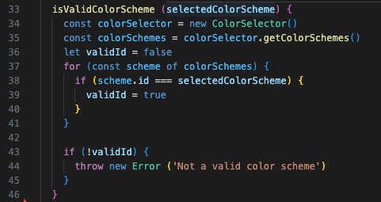
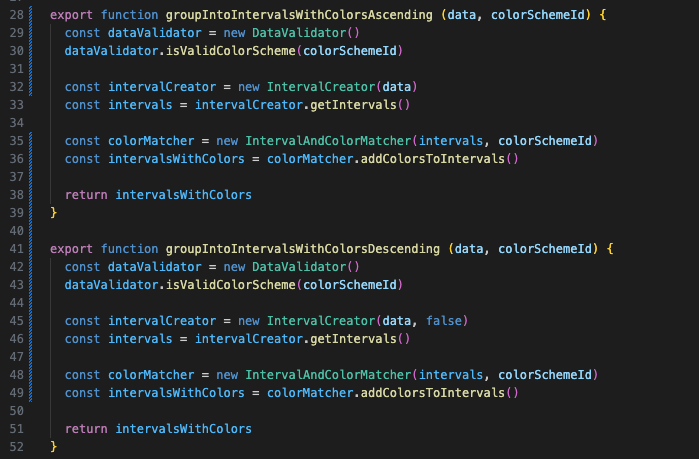

## Tabellreflektion för funktioner och metoder
| Metodnamn | Länk eller kod | Antal rader (ej ws) | Reflektion |
| --------- | -------------- | ------------------- | ---------- |
| ColorCreator.**createColors()**  |  | 13 | **Functions should be Small and Do one thing**: Metoden är lång och innehåller en If-sats inuti en for-loop. For-loopen är längre än den skulle behöva vara eftersom jag valde en for/of-loop i kombination med ett extra index-värde som räknas upp, i stället för en klassisk for-loop. Men eftersom funktionen jobbar med två arrayer med väldigt snarlika namn tyckte jag att for/of-loopen blev tydligare. Den extra arrayen behövs eftersom jag inte bara vill lägga till de nya färgerna i slutet av den befintliga arrayen utan sortera om alla färger så att de blir sorterade efter färgskala. If-satsen har en inline-kommentar som skvallrar om att den delen skulle kunna brytas ut till en egen metod. Metoden gör flera saker i om att den både lägger till nya värden till en array och kollar ifall det är sista värdet i input-arrayen.  |
| DataValidator. **isValidColorScheme (selectedColorScheme)**  |  | 11 | **Do one thing**: For-loppen som används för att kontrollera om id:t motsvarar ett schema-id skulle kunna brytas ut till en egen metod. Den metoden skulle även vara användbar för att få bort den dåliga koden i sista exemplet nedan. |
| IntervalCreator. **fillIntervalWithData()** |  | 10 | **Blocks and indenting - level of indenting should be one or two**: Metoden har tre nivåer av indentering eftersom den har nästlade for-for-if-satser. Dessa skulle kunna brytas ut till egna metoder för att göra koden mer lättläst. |
| IntervalCreator. **defineIntervalBoundariesAscending (numberOfIntervals, intervalWidth)**   IntervalCreator. **defineIntervalBoundariesDescending (numberOfIntervals, intervalWidth)** | | 8 | **DRY**: Dessa två metoder är nästan identiska. De används för att lowerBoundary och upperBoundary blir omvända när det är en descending array. Vid en descending array behöver dessutom intervalWidth subtraheras i stället för adderas. Jag testade att ha endast en metod som också kollar värdet på isAscending men det kändes som att den blev mer komplex än att ha två snarlika.  **Blocks and indenting - blocks within statements should be one line long**: Författaren nämner bara if-, else- och while-satser och i dessa två metoder är det en for-loop. Men den innehåller tre rader kod som skulle kunna brytas ut till en egen metod. Eventuellt skulle det vara ett steg mot att bara behöva ha en metod i stället för två snarlika. Jag har dessutom refaktorerat klassen efterhand och gjort numberOfIntervals och intervalWidth till instansvariabler. Men jag har missat att uppdatera dessa två metoder efter det utan skickar fortfarande in värdena som argument. |
| **groupIntoIntervalsWithColorsAscending (data, colorSchemeId)**  **groupIntoIntervalsWithColorsDescending (data, colorSchemeId)** | | 7 | **DRY**: Dessa två metoder är nästan identiska, men det var ett medvetet val. Jag hade bara en metod först, men då var användaren tvungen att skicka tre argument (data, colorSchemeID, isAscending) och det bröt mot principen att **undvika triadiska funktioner.**  Eftersom det vid två eller fler argument är lätt att kasta om argumenten var jag då tvungen att ha en extra validering som kollade att id:t verkligen var ett id och att isAscending var en boolean eller hade utelämnats. Jag var då också tvungen att lägga isAscending sist i parameterlistan eftersom det är ok att utelämna den. Detta blev inte intuitivt då det känns som att data och isAscending hör ihop (de används av samma klass). |
| ColorSelector. **getSelectedColorScheme (id)**  |  | 1 | **Dålig kod**: Metoden innehåller bara en rad kod, men den är dålig. Den använder det inskickade id:t för att beräkna indexet av det objektet i arrayen som ska returneras. I fall man i framtiden uppdaterar id:na till en annan nummerserie eller tar bort ett av objekten i mitten, så kommer den metoden returnera fel objekt. |
